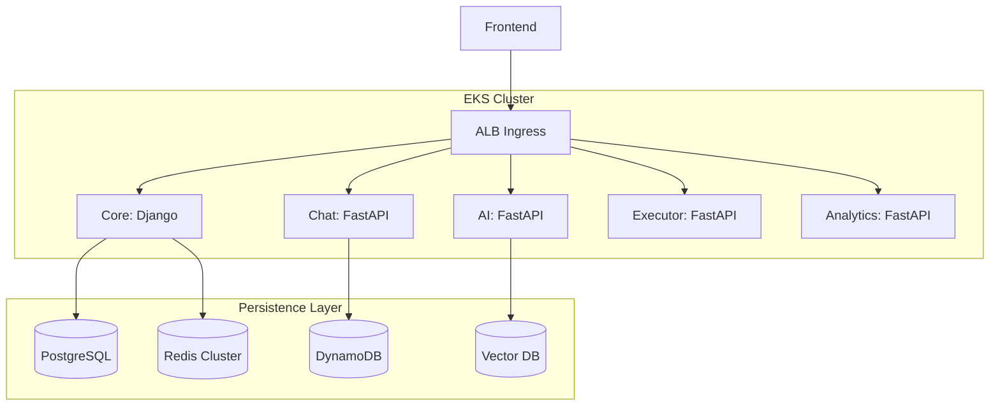

# CLASHCODE

| Status | Production Ready |
| --- | --- |
| Architecture | Distributed Microservices |
| Platform | EKS / Kubernetes |
| Cloud | AWS |

CLASHCODE is a high-availability, gamified competitive programming platform. Engineered for precision, it implements a microservices-driven architecture with strictly isolated execution environments.

## System Architecture

The platform operates on Amazon EKS, leveraging an AWS Application Load Balancer for traffic orchestration.

## Service Inventory

* [Core API](./services/core) | Django 5 / DRF | Authentication, XP Logic, Payments, Persistence
* [Chat Service](./services/chat) | FastAPI / WebSockets | Real-time Messaging, Presence, History
* [AI Tutor](./services/ai) | FastAPI / LangChain | RAG-based Analysis, Contextual Hints
* [Executor](./services/executor) | FastAPI / Docker SDK | Sandboxed Code Evaluation
* [Analytics](./services/analytics) | FastAPI / Prometheus | System Health, Metrics Aggregation
* [Frontend](./frontend) | React 19 / Vite | Client Arena, ZLS Architecture

## Infrastructure & Deployment

### Production (EKS)
Provisioning is managed via Kubernetes manifests.
* Secret Synchronization: `kubectl apply -f infra/k8s/base/external-secrets.yaml`
* Stack Rollout: `kubectl apply -k infra/k8s/overlays/prod/`

### Development (Local)
Local emulation via Docker Compose.
* `docker compose -f services/docker-compose.yml up -d --build`

## Security Protocol

* Sandbox: Untrusted code executed in network-isolated, non-root containers.
* Isolation: Private subnet VPC topology with ALB restricted ingress.
* Cryptography: JWT Refresh Token Rotation with Redis-backed session revocation.
* Audit: Immutable transaction logs for all point (XP) and code operations.

## License
MIT License.
