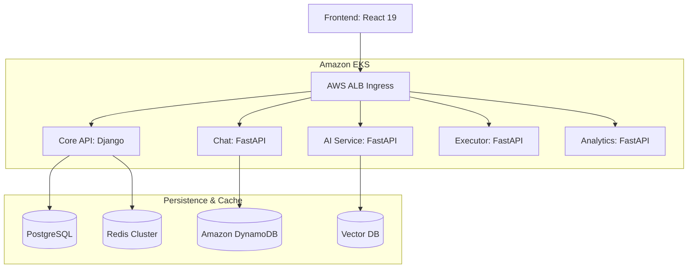

# CLASHCODE

CLASHCODE is a fun, game-like platform where you can learn and practice coding. Instead of just reading text, you solve challenges to unlock new levels and move through a digital world. With real-time chat and an AI mentor to help when you're stuck, it’s the perfect place to build your skills and connect with other coders.

---

### 🚀 Key Features

*   **🎮 Gamified Progression**: Master coding concepts through a dynamic, level-based game world.
*   **🤝 Real-Time Chat**: Global messaging hub with presence tracking and persistent history via DynamoDB.
*   **🤖 AI-Powered Mentorship**: RAG-based AI tutor providing contextual hints and automated code analysis.
*   **⚡ Secure Execution**: Untrusted code is evaluated in network-isolated, ephemeral Docker containers.
*   **📊 Analytics & Monitoring**: Real-time cluster telemetry and health diagnostics via Prometheus.

---

### 🏗️ Architecture

CLASHCODE is orchestrated on **Amazon EKS** and leverages a distributed topology for maximum scalability.

---

### 🛠️ Technology Stack
*   **Frontend**: React 19, Vite, Zustand, Tailwind CSS, Framer Motion
*   **Backend**: Python (FastAPI, Django), Celery
*   **Databases**: PostgreSQL, DynamoDB, Pinecone, Redis
*   **Infrastructure**: Kubernetes (EKS), Docker, AWS, Terraform

---

### 🔒 Security Posture

*   **Isolation**: Untrusted code executes in network-isolated, non-root containers.
*   **Secrets**: Managed via `external-secrets.io` with AWS Secrets Manager integration.
*   **Identity**: Fine-grained resource access via IAM Roles for Service Accounts (IRSA).
*   **Validation**: AST-based pre-validation for all submitted code snippets.

---

### 📄 License
Licensed under the **MIT License**.
