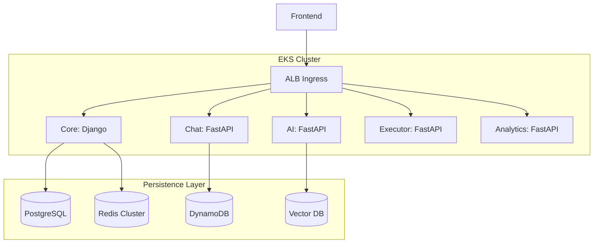

# CLASHCODE

Welcome to CLASHCODE. This project is all about making coding fun again. We've built a place where you can jump in, solve challenges, and feel like you're part of a real game world rather than just staring at a dry code editor.

### What it is all about
When you first log in, you'll see a world of levels waiting for you. Every challenge you beat unlocks something new, so you're not just practicing syntax—you're progressing through a journey. If you ever get stuck, our built-in mentor is there to give you a nudge in the right direction without spoiling the solution. Plus, there's a global chat where you can hang out with other developers, share your wins, or just ask for a hand.

### How we built it
We wanted this to be as solid as it is fun. Under the hood, everything is split into small, focused services that talk to each other to keep the platform fast and reliable. We use Amazon EKS to manage everything in the cloud, so it stays smooth even when lots of people are coding at once. Safety is a big deal for us too. Whenever you run code, it happens in a secure, isolated space so you can experiment without any worries. We use DynamoDB to keep your messages safe and Redis to make sure everything feels instant.

### Jumping in
If you're here to play, just head over to the platform and start your first challenge. No complex setup is needed on your end.

If you're a developer and want to see how it works or help out, the process is pretty simple. Start by cloning the code from the repository. We use Docker to get all the backend services running with one command, which you can find in the services folder. Once those are up, just jump into the frontend directory, install the packages, and start the development server. We've tried to keep the setup as straightforward as possible so you can spend more time building and less time debugging your environment.

### Keeping things safe
We've put a lot of work into the security of the platform. Between secure login systems, private networking, and careful code validation, we make sure your data stays protected and the playground stays fun for everyone.

### License
We've released CLASHCODE under the MIT License, so feel free to explore, learn, and build upon what we've started here. Join us in making the future of coding education a bit more exciting.
