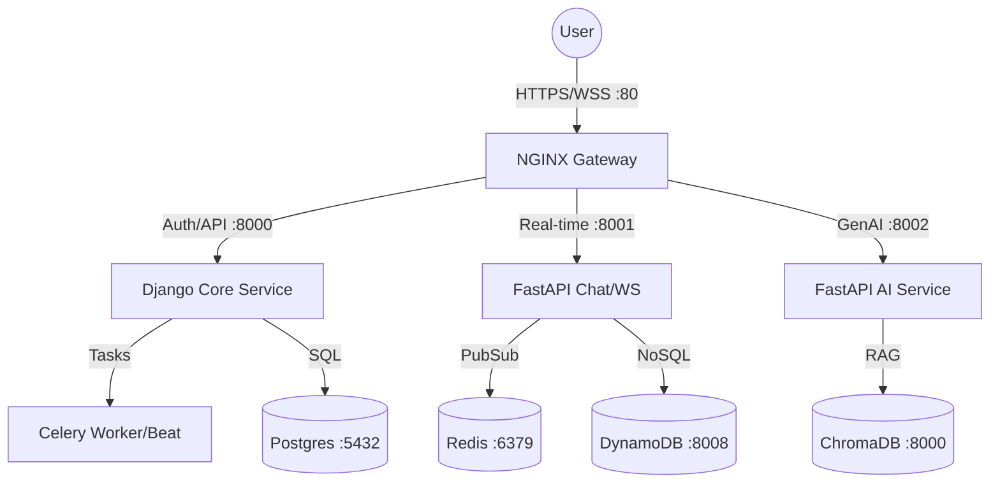

# ⚔️ CLASHCODE - Backend Services

A high-performance, distributed microservices architecture powering the **CLASHCODE** platform. Built with a focus on real-time engagement, AI-driven code analysis, and robust competitive scalability.

---

## 🏛️ System Architecture

The platform is designed as a modular ecosystem of specialized services. In local development, these services run as independent processes.



| Service | Technology | Port | Role |
| :--- | :--- | :--- | :--- |
| **[Core](./core)** | Django / DRF | 8000 | Central API, Auth, DB, Payments, Celery Tasks. |
| **[Chat](./chat)** | FastAPI / WS | 8001 | Real-time messaging, Presence tracking. |
| **[AI](./ai)** | FastAPI / LangChain | 8002 | Challenge Generation, Code analysis. |

---

## 🛠️ Technology Stack

- **Core Frameworks**: Django 5.0, FastAPI
- **Databases**: PostgreSQL, DynamoDB Local, ChromaDB (Vector)
- **Real-time**: Redis & WebSockets
- **Task Queue**: Celery with Redis Broker

---

## 🚀 Local Development Setup

### 1. Start Infrastructure (Databases)
We use Docker for the heavy lifting (databases) while keeping the application code local.
```bash
docker-compose up -d
```

### 2. Configure Environment
Ensure `.env` files in `core/`, `chat/`, and `ai/` are configured to point to `localhost`.

### 3. Start Services

#### **Core Service (Django)**
```bash
cd core
python -m venv venv
./venv/Scripts/activate  # Windows
pip install -r requirements.txt
python manage.py migrate
python manage.py runserver 0.0.0.0:8000
```

#### **Chat Service (FastAPI)**
```bash
cd chat
python -m venv venv
./venv/Scripts/activate
pip install -r requirements.txt
uvicorn main:app --port 8001 --reload
```

#### **AI Service (FastAPI)**
```bash
cd ai
python -m venv venv
./venv/Scripts/activate
pip install -r requirements.txt
uvicorn main:app --port 8002 --reload
```

#### **Celery Workers (Required for Core)**
```bash
cd core
# In a new terminal
celery -A project worker --loglevel=info
# In another terminal
celery -A project beat --loglevel=info
```

---

## 📂 Repository Structure

```text
├── core/           # Django project: Main logic, Auth, DB
├── chat/           # FastAPI: Real-time WebSockets
├── ai/             # FastAPI: AI-driven features & Vector RAG
└── docker-compose.yml # Infrastructure only
```

---

## 📄 License

This project is proprietary. All rights reserved.
