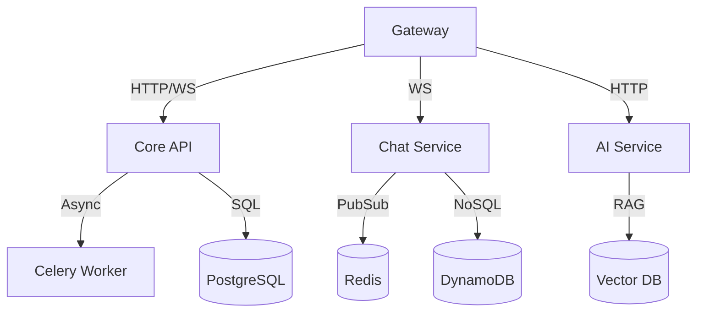

# CLASHCODE - Backend Services

| Architecture | Distributed Microservices |
| --- | --- |
| Gateway | NGINX / AWS ALB |
| Communication | REST / gRPC / WebSockets |

Distributed backend ecosystem powering the CLASHCODE arena. Focused on high-concurrency, secure code execution, and real-time state synchronization.

## Architecture Topology

## Service Catalog

| Service | Stack | Function |
| --- | --- | --- |
| [Core](./core) | Django 5 | Primary business logic, Auth, DB orchestration. |
| [Chat](./chat) | FastAPI | Real-time messaging, presence, history. |
| [AI](./ai) | FastAPI | RAG-based analysis, automated hints. |
| [Executor](./executor) | FastAPI | Sandboxed code evaluation. |
| [Analytics](./analytics) | FastAPI | Metrics proxy and health monitoring. |

## Operations

### Environment Configuration
* Sync `.env` files across services based on `.env.example` templates.
* Required: `JWT_PRIVATE_KEY`, `POSTGRES_PASSWORD`, `REDIS_URL`.

### Orchestration (Development)
* `docker compose up -d --build`

### Security Compliance
* Container Sandboxing: Network-isolated Docker containers for user code.
* gVisor Support: Harden isolation via `CONTAINER_RUNTIME=runsc`.
* VPC Integrity: Services restricted to internal network segments.

## License
Proprietary. All rights reserved.
