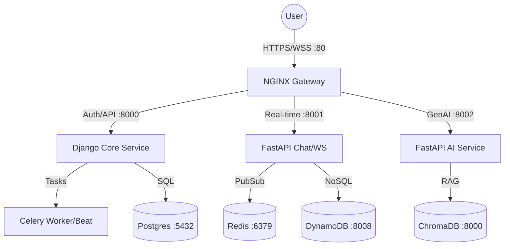

# ⚔️ CLASHCODE - Backend Services

A high-performance, distributed microservices architecture powering the **CLASHCODE** platform. Built with a focus on real-time engagement, AI-driven code analysis, and robust competitive scalability.

---

## 🏛️ System Architecture

The platform is designed as a modular ecosystem of specialized services. In local development, these services run as independent processes.



| Service | Technology | Port | Role |
| :--- | :--- | :--- | :--- |
| **[Core](./core)** | Django / DRF | 8000 | Central API, Auth, DB, Payments, Celery Tasks. |
| **[Chat](./chat)** | FastAPI / WS | 8001 | Real-time messaging, Presence tracking. |
| **[AI](./ai)** | FastAPI / LangChain | 8002 | Challenge Generation, Code analysis. |

---

## 🛠️ Technology Stack

- **Core Frameworks**: Django 5.0, FastAPI
- **Databases**: PostgreSQL, DynamoDB Local, ChromaDB (Vector)
- **Real-time**: Redis & WebSockets
- **Task Queue**: Celery with Redis Broker

---

## 🚀 Production-Style Docker Setup

The supported deployment model is container-first. The Compose file builds and runs nginx, the production frontend image, Django, FastAPI services, Celery workers, the Python-only executor, and private backing services. Only nginx is published to the host.

### 1. Configure Environment

Create environment files from the examples and replace every placeholder.

```bash
cp .env.example .env
cp core/.env.example core/.env
cp chat/.env.example chat/.env
cp ai/.env.example ai/.env
```

Set strong values for:

- `POSTGRES_PASSWORD`
- Django `SECRET_KEY`
- `JWT_PRIVATE_KEY` and `JWT_PUBLIC_KEY`
- `INTERNAL_API_KEY` and `INTERNAL_SIGNING_SECRET`
- OAuth, SMTP, Cloudinary, Firebase, and Razorpay credentials

### 2. Start Services

```bash
docker compose up -d --build
```

Compose runs migrations and `collectstatic` before starting Gunicorn. Databases, Redis, Chroma, DynamoDB, and the executor stay private on the Docker network.

For stronger Python execution isolation, install gVisor on the Docker host and set `CONTAINER_RUNTIME=runsc` in `.env`.

---

## 📂 Repository Structure

```text
├── core/           # Django project: Main logic, Auth, DB
├── chat/           # FastAPI: Real-time WebSockets
├── ai/             # FastAPI: AI-driven features & Vector RAG
└── docker-compose.yml # Infrastructure only
```

---

## 📄 License

This project is proprietary. All rights reserved.
